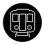

# Godot moving platform
## Info.
An example of moving system.
Cable car and a metrowagon model is under CC-BY license (made by me!)
The TransportSystem code is licensed under [BSD-2 with Patent Exception](/LICENSE)

## How to create "transport" and make it moving
1. Import your model
2. Create "TransportSystem" node as a root of new prefab scene
3. Move all meshes (except doors) under an AnimatableBody3D
4. Set the animatable path to AnimatableBody3D in a dialog
5. For opening doors, these animations "door_open_left" and "door_open_right" must be in this scene. If they don't exist, you need to create them.
6. Create Area3D and a collision shape (fill the player area in this shape). Connect the `body_entered` and `body_exited` signals to `on_player_area_body_entered()` and `on_player_area_body_exited()`. (Necessary for smooth movement)
7. (Optional) Create DoorSounds node3d and put AudioStreamPlayers3D to play the door sounds.
8. (Optional) Create Move AudioStreamPlayer3D for playing Move sounds.
9. Create or open a game scene with Path3D.
10. Add the transport prefab as a child to Path3D

